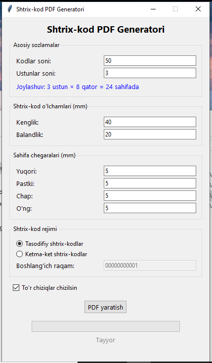

# 📦 Shtrix-kod PDF Generatori

A simple yet powerful **Barcode PDF Generator** for Windows — built with **Python (Tkinter, ReportLab, and python-barcode)**.  
Easily generate **random or sequential Code128 barcodes** and export them neatly arranged in a **PDF grid layout**.

---

## Screenshot



---

## ✨ Features

- Generate **random** or **sequential** barcodes.
- Customize:
  - Number of barcodes
  - Columns and layout
  - Barcode size (width & height)
  - Page margins
- Optional **grid lines** for visual separation.
- Real-time **progress bar** and **status display**.
- Automatically saves your last-used settings.
- PDF output ready for printing or labeling.

---

## Requirements (for source build)

If you want to run from source (not using the `.exe`), install:
```bash
pip install -r requirements.txt
````
or
```bash
pip install pillow python-barcode reportlab
````

---

## Running on Windows

### Option 1 — Use the prebuilt executable

1. Locate the file **`main.exe`** in this folder.
2. Double-click it to launch the app.
3. Choose your settings and click **“PDF yaratish”** to generate the barcode sheet.

No installation required — just run and use!

---

### Option 2 — Run from Python source

If you have Python installed:

```bash
python main.py
```

---

## Output

* Barcodes are saved in a single **PDF file** you choose.
* Each page is automatically filled with your selected number of rows and columns.
* Example output file:


  ```
  shtrix_kodlar.pdf
  ```

---

## App Settings

All app settings (count, layout, mode, margins, etc.) are stored automatically in:

```
barcode_settings.json
```

You can safely delete it to reset the defaults.

---

## Build Executable (optional)

If you want to rebuild your own `.exe`:

```bash
pyinstaller main.spec
```

Or manually:

```bash
pyinstaller --onefile --noconsole main.py
```

---

## 📄 License

This project is free to use and modify for personal or educational purposes.

---

**Made with ❤️ in Python and Tkinter**
